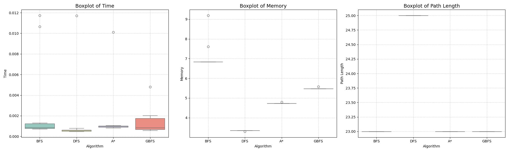
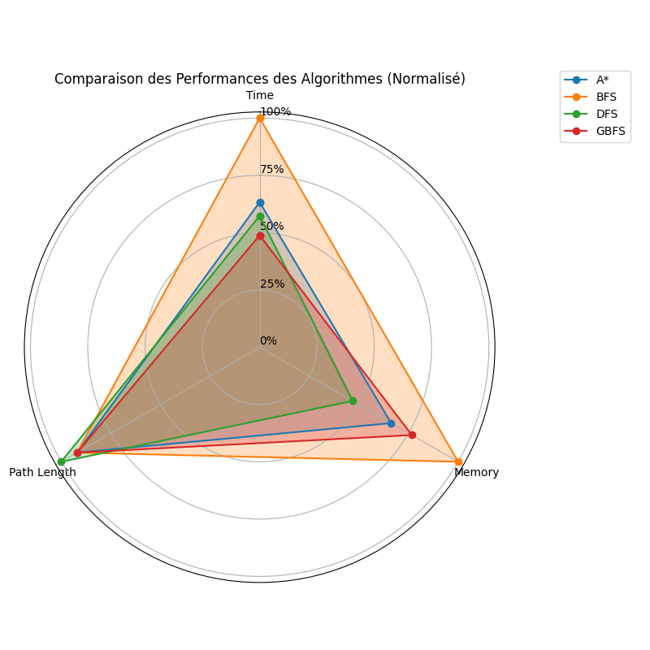

# MazeSolver2 : Algorithmes de Recherche Informée et Non-Informée

Ce projet implémente et compare différents algorithmes de recherche pour résoudre des labyrinthes complexes de type grille. L'objectif est d'analyser les performances des algorithmes en termes de coût du chemin, de temps d'exécution et de nombre de nœuds explorés.

## 🚀 Fonctionnalités
* **Génération de Labyrinthes** : Création de grilles avec obstacles.
* **Algorithmes implémentés** :
    * **Recherche non-informée** : BFS (Breadth-First Search) et DFS (Depth-First Search).
    * **Recherche informée** : Algorithme A* utilisant la distance de Manhattan comme heuristique.
* **Visualisation** : Comparaison graphique des résultats via Matplotlib.

## 🛠️ Technologies Utilisées
* **Langage** : Python 3.13
* **Environnement** : Kali Linux (WSL) / VS Code
* **Bibliothèques** : `Matplotlib`, `Collections`, `Time`.

## 📂 Structure du Projet
```bash
.
├── main.py              # Point d'entrée de l'application
├── algorithms.py        # Implémentation de BFS, DFS et A*
├── config_maze.py       # Configuration et génération du labyrinthe
├── visualization.py     # Logique de rendu des graphiques
├── Dockerfile           # Configuration pour la conteneurisation
├── boxplots.png         # Graphique des performances
├── pie_charts.png       # Répartition par algorithme
├── radar_chart.png      # Comparaison multi-critères
└── README.md            # Documentation du projet

# Maze Solver Project

## Boxplots


## Pie Charts


## Radar Chart

